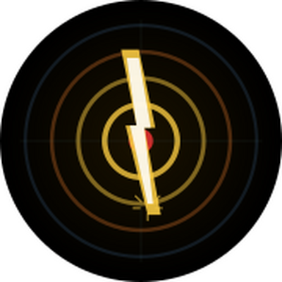

  

  # Strikemap

  **Point at a flash. Tap. Tap again at thunder. Watch the storm.**

  [strikemap.benneely.com](https://strikemap.benneely.com) · [Desktop version](https://strikemap.benneely.com/desktop.html)

---

## What it is

Strikemap is a single-file, no-build, no-account lightning tracker. You point your phone toward a flash, tap SAW FLASH, then tap HEARD THUNDER when the sound arrives. From the delay alone it works out distance (speed of sound), and if you aimed the compass ring at the flash, it works out bearing too. Each strike gets logged, color-coded by age, and plotted on a live map as an uncertainty region — so over the course of a storm you can actually watch it approach or recede, not just see one flash at a time.

No server, no API keys, no login. Open the URL, it works. Multiple people can use the same link independently — everyone tracks on their own device, nothing is shared or synced.

Two versions live at the same domain:
- **[strikemap.benneely.com](https://strikemap.benneely.com)** (`index.html`) — mobile, single-column, locked map, compass-driven
- **[strikemap.benneely.com/desktop.html](https://strikemap.benneely.com/desktop.html)** (`desktop.html`) — two-column, fully interactive map, couch mode on by default (no compass on a laptop), manual location entry

Both write to the same `localStorage` key, so if you have them open in the same browser, strikes recorded on one show up on the other.

## The idea

The concept dates back to around 2007 — point at lightning, tap at thunder, get a distance — but there wasn't a practical way to build it at the time. It got picked back up and properly designed in early 2026, then built out over a series of focused sessions in May 2026. See [`PLAN.md`](PLAN.md) for the full design rationale and [`NOTES.md`](NOTES.md) for session-by-session implementation notes and gotchas — both are a genuinely detailed record if you want to see how the geometry evolved.

## How the geometry works

The core trick is a "pizza crust" — an annular sector, not the ellipse the first mockup used. Two independent error sources define it, both measured from *you*, the observer:

- **Bearing error (±10°):** how precisely you can point a phone at a flash. This fans out as a wedge — wider at greater distance.
- **Timing error (±500ms):** how precisely you can tap in reaction to a sound. This is a constant-depth band regardless of distance.

The intersection of the wedge and the band is the actual uncertainty region for where the strike happened — plotted directly on the map, color-coded by how recent the strike is (yellow → orange → blue-grey as it ages, soft-expiring after an hour). If you're recording from inside with no line of sight (couch mode), there's no bearing — just a dashed bullseye ring at the measured distance instead of a wedge.

## Features

- Real-time flash → thunder → distance/bearing calculation
- Live map (CartoDB Dark Matter tiles, no API key) with per-strike uncertainty regions
- Age-based color coding and soft expiry (old strikes fade, then drop off the map but stay in the log)
- Trend indicator — approaching / receding / steady, based on recent strikes
- Couch mode — distance-only tracking with no compass
- Desktop companion with address search, manual lat/lon entry, and a fully interactive map
- Installable to your phone's home screen (Apple touch icon included)

## Files

| File | Description |
|---|---|
| `index.html` | Mobile app — live file |
| `desktop.html` | Desktop companion — live file |
| `strikemap-mockup.html` | Original static UI mockup from the first design conversation — kept as a historical artifact, not the live app |
| `PLAN.md` | Full design rationale, decisions, and session-by-session plan |
| `NOTES.md` | Implementation notes and gotchas from each build session |
| `icons/` | App icon (favicon + Apple touch icon) |
| `LICENSE.md` | PolyForm Noncommercial 1.0.0 |

## Stack

Vanilla JS, [Leaflet](https://leafletjs.com/) for the map, CartoDB Dark Matter tiles, Google Fonts. No build step, no npm, no framework — each HTML file is fully self-contained and can be hosted anywhere static files are served.

## License

[PolyForm Noncommercial 1.0.0](LICENSE.md) — free to use, modify, and share for any noncommercial purpose. Feature requests and bug reports are welcome via [Issues](../../issues).
